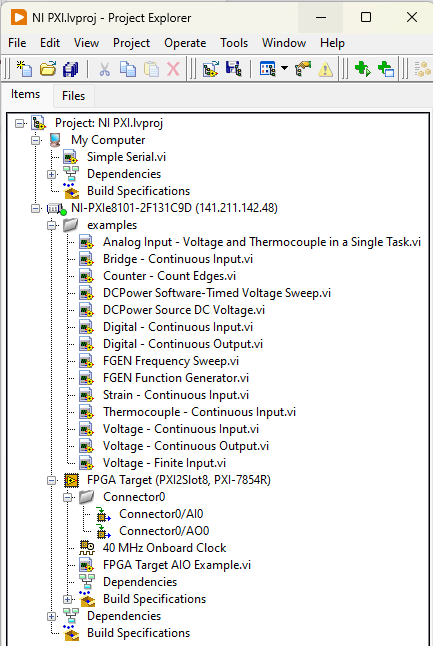

# NI-Documentation-Examples
# Table of Contents
[Getting Started](#getting-started)

[Examples](#examples)

[File I/O on Embedded PXI/Real-Time Targets](#file-io-on-embedded-pxireal-time-targets)

# Getting Started

Before running the examples, make sure your development PC is connected to the PXI. The easist way is to connect using an ethernet cable and make sure your connection's IP address contains the same first three sets of numbers as the PXI (posted on the unit, probably 141.211.142.XXX) and are on the same subnet (255.255.255.0). You can check to see if the PXI shows up as a Remote Device in NI MAX. If it is there, you are good. 

Because we have an embedded real-time target, you MUST open LabVIEW VI's through a project. Otherwise, the modules will not be found. Below is a snapshot of what this will look like:

s

# Examples

There are many, many more examples by going to the LabVIEW Help->Find Examples menu, but I've included a few to get you started.

- Analog Input - Voltage and Thermocouple in a Single Task.vi
- Bridge - Continuous Input.vi
- Counter - Count Edges.vi
- DCPower Software-Timed Voltage Sweep.vi
- DCPower Source DC Voltage.vi
- Digital - Continuous Input.vi
- Digital - Continuous Output.vi
- FGEN Frequency Sweep.vi 
- FGEN Function Generator.vi
- Simple Serial.vi
- Strain - Continuous Input.vi
- Thermocouple - Continuous Input.vi
- Voltage - Continuous Input.vi
- Voltage - Continuous Output.vi	
- Voltage - Finite Input.vi

# File I/O on Embedded PXI/Real-Time Targets

You will probably be in a situation where you need to log data. Again, our controller is real-time target with its own OS. You can handle file I/O in one of two ways:

1. You can include things like Network Streams in your VI's to transfer data from the RTOS to the Windows OS. Data will be stored on the Windows Host Machine. This is a lossless data transfer and works well, but can be mildly annoying to work with. This is good if you are collecting a high volume of data and need more storage space. 
2. You can store data directly on the PXI and trasnfer it off later using something like FTP
    - https://www.ni.com/en/support/documentation/supplemental/06/ftp-options-with-labview-real-time.html?srsltid=AfmBOoqKwedfe83odQkYlwveF7E_DG50WnYMAZr1q8Xd3NtiMTPplXgB
    - This is good if storage space is not a concern/only have small files/want to do things the easy way.
